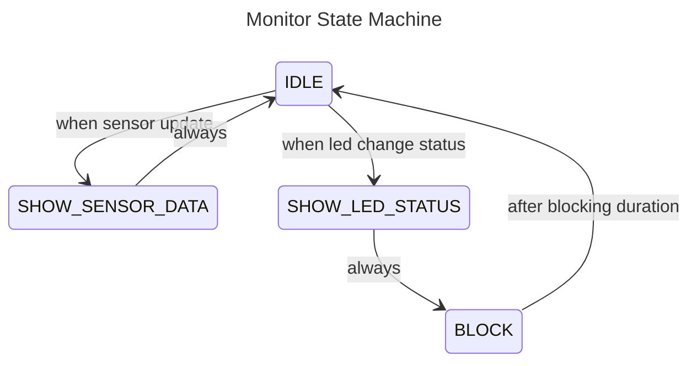
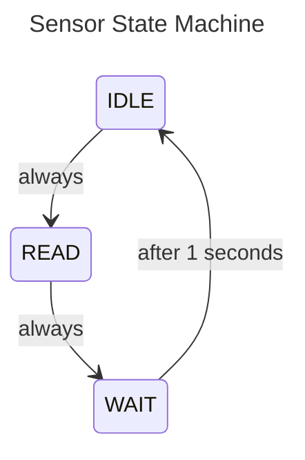
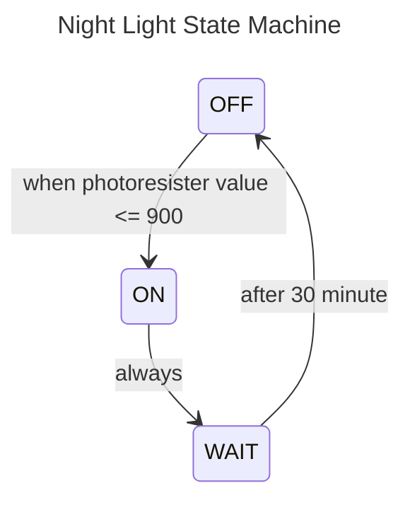
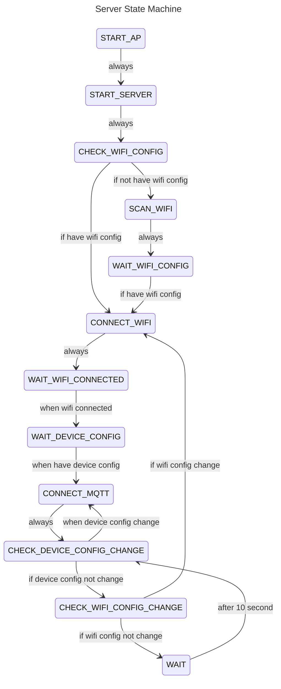

### State Machine Diagram

```mermaid
---
title: Monitor State Machine
---
stateDiagram-v2
    IDLE --> SHOW_SENSOR_DATA: when sensor update
    SHOW_SENSOR_DATA --> IDLE: always
    IDLE --> SHOW_LED_STATUS: when led change status
    SHOW_LED_STATUS --> BLOCK: always
    BLOCK --> IDLE: after blocking duration
```

```mermaid
---
title: Sensor State Machine
---
stateDiagram-v2
    IDLE --> READ: always
    READ --> WAIT: always
    WAIT --> IDLE: after 1 seconds
```

```mermaid
---
title: Night Light State Machine
---
stateDiagram-v2
    OFF --> ON: when photoresister value <= 900
    ON --> WAIT: always
    WAIT --> OFF: after 30 minute
```

```mermaid
---
title: Server State Machine
---
stateDiagram-v2
		START_AP --> START_SERVER: always
		START_SERVER --> CHECK_WIFI_CONFIG: always
		CHECK_WIFI_CONFIG --> CONNECT_WIFI: if have wifi config
		CHECK_WIFI_CONFIG --> SCAN_WIFI: if not have wifi config
		SCAN_WIFI --> WAIT_WIFI_CONFIG: always
		WAIT_WIFI_CONFIG --> CONNECT_WIFI: if have wifi config
		CONNECT_WIFI --> WAIT_WIFI_CONNECTED: always
		WAIT_WIFI_CONNECTED --> WAIT_DEVICE_CONFIG: when wifi connected
    WAIT_DEVICE_CONFIG --> CONNECT_MQTT: when have device config
    CONNECT_MQTT --> CHECK_DEVICE_CONFIG_CHANGE: always
    CHECK_DEVICE_CONFIG_CHANGE --> CONNECT_MQTT: when device config change
    CHECK_DEVICE_CONFIG_CHANGE --> CHECK_WIFI_CONFIG_CHANGE: if device config not change
    CHECK_WIFI_CONFIG_CHANGE --> WAIT: if wifi config not change
    CHECK_WIFI_CONFIG_CHANGE --> CONNECT_WIFI: if wifi config change
    WAIT --> CHECK_DEVICE_CONFIG_CHANGE: after 10 second
```

