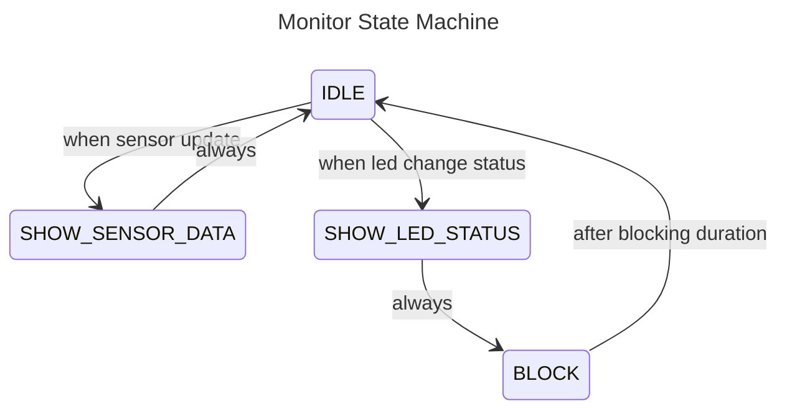
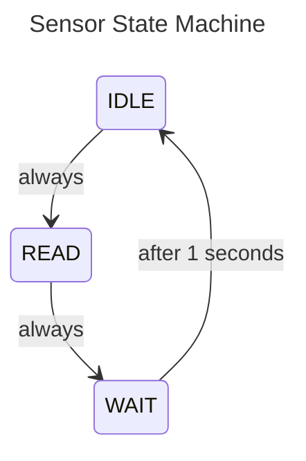
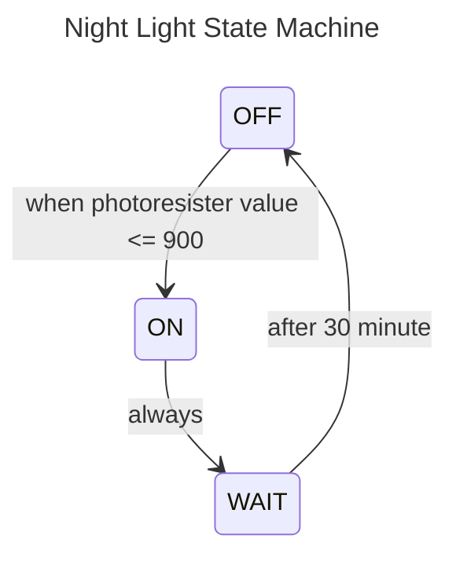

### State Machine Diagram

```mermaid
---
title: Monitor State Machine
---
stateDiagram-v2
    IDLE --> SHOW_SENSOR_DATA: when sensor update
    SHOW_SENSOR_DATA --> IDLE: always
    IDLE --> SHOW_LED_STATUS: when led change status
    SHOW_LED_STATUS --> BLOCK: always
    BLOCK --> IDLE: after blocking duration
```

```mermaid
---
title: Sensor State Machine
---
stateDiagram-v2
    IDLE --> READ: always
    READ --> WAIT: always
    WAIT --> IDLE: after 1 seconds
```

```mermaid
---
title: Night Light State Machine
---
stateDiagram-v2
    OFF --> ON: when photoresister value <= 900
    ON --> WAIT: always
    WAIT --> OFF: after 30 minute
```
