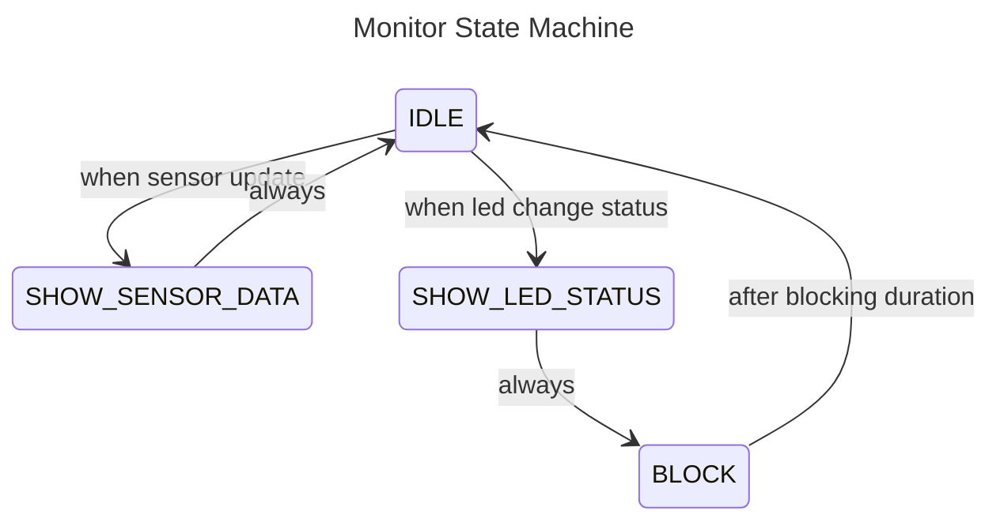
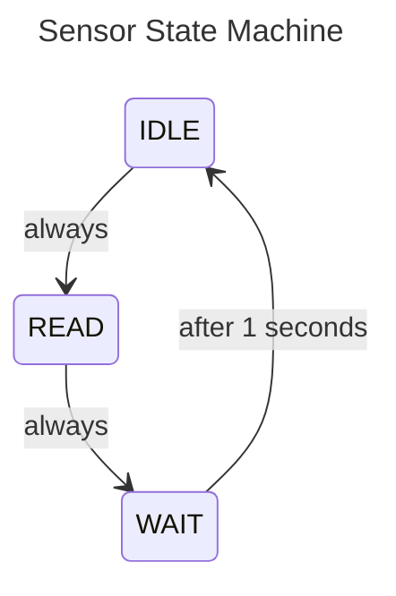
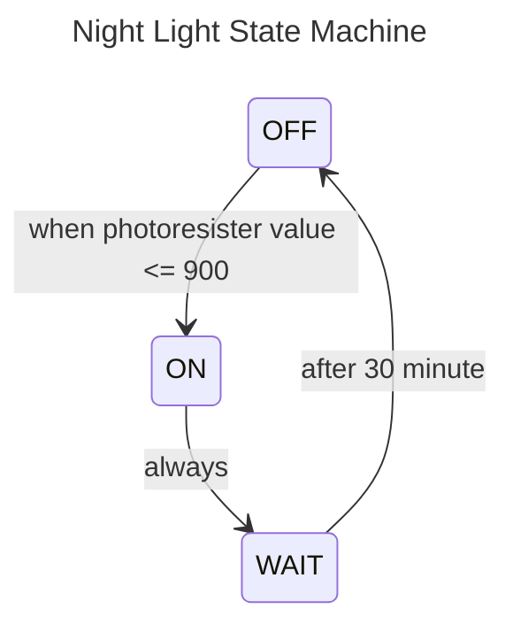
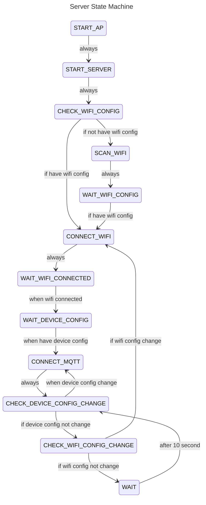

# Project Description

this is a iot project for me to enter the embedded programing world.

the functionality for this project:

1. detect temperture and humidity of the room using the dht11 sensor
2. detect the light intensity of the room and open the night light led if room is too dark
3. upload the sensor data that esp32 readed and upload to the cloud using mqtt

## Hardware

### Project Photo

front:


back:


### The Schematic Diegram


### The PCB Latout


## Software

### Requirement

* platformio cli
* make

### How to run

1. clone the repository

2. plugin the esp32 to your computer

3. run this command to install all dependency this project use

   ```shell
   pio run -t compiledb
   ```

4. run this command, the code should be upload to the esp32 and execute

   ```shell
   make upload
   ```

5. run this command, it will show the output log from esp32

   ```shell
   make monitor
   ```

### State Machine Diagram

this project is design using a pattern called `finite state machine`, which is commonly used in the embedded system.

for this project, i create 4 state machine to implement all feature, which include:

1. read sensor data
2. display sensor data at ssd1306 monitor
3. create a web server for fill up the wifi & device config
4. upload the sensor data to the cloud via mqtt

#### Monitor state machine

this state machine response to display infomation to the monitor, when nothing happen, it should be display the sensor data, but when the led change the status (turn on or turn off), it should display a full frame message to indicate this event



#### Sensor state machine

this state machine response to read the sensor data every second and send by callback function



#### Nigh light state machine

this state machine response to detect the photoresister value is below 900 (which means the room is dark), and open the led as a night light



#### Server state machine

this state machine response for create a web server and handle the incoming request for fill up the wifi and device config


